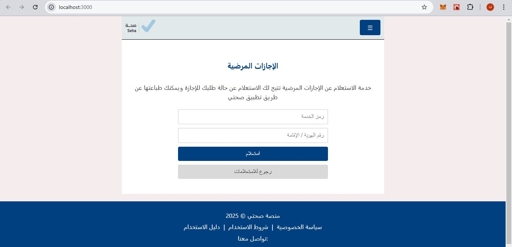
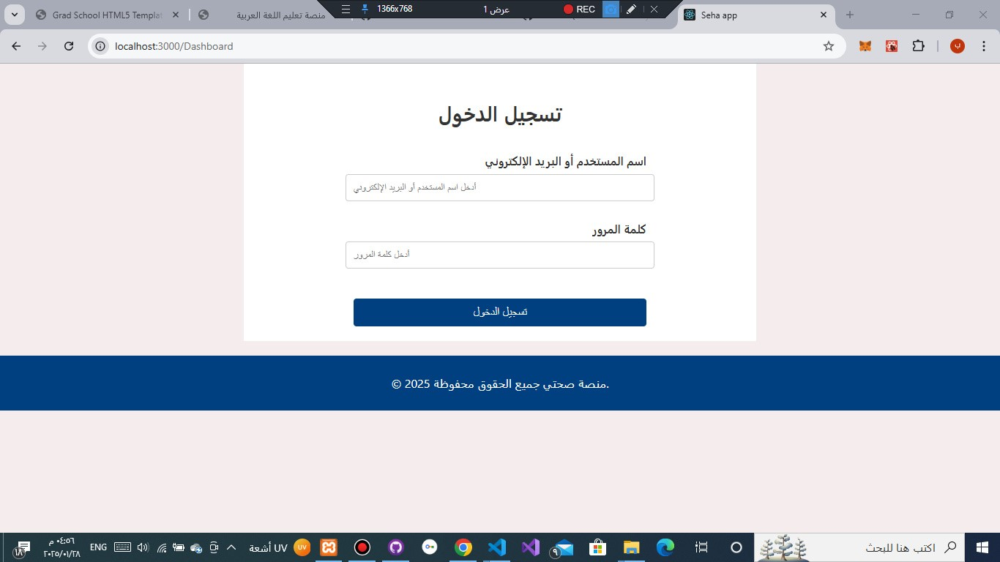
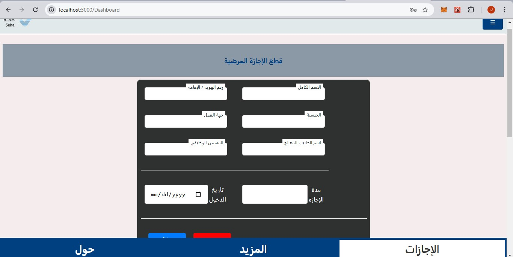
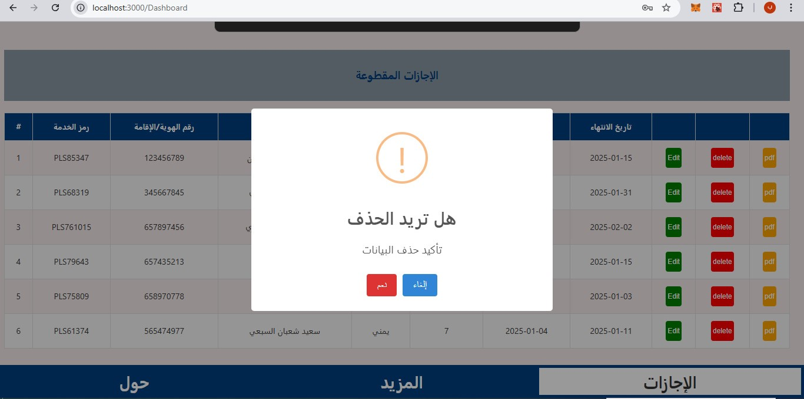
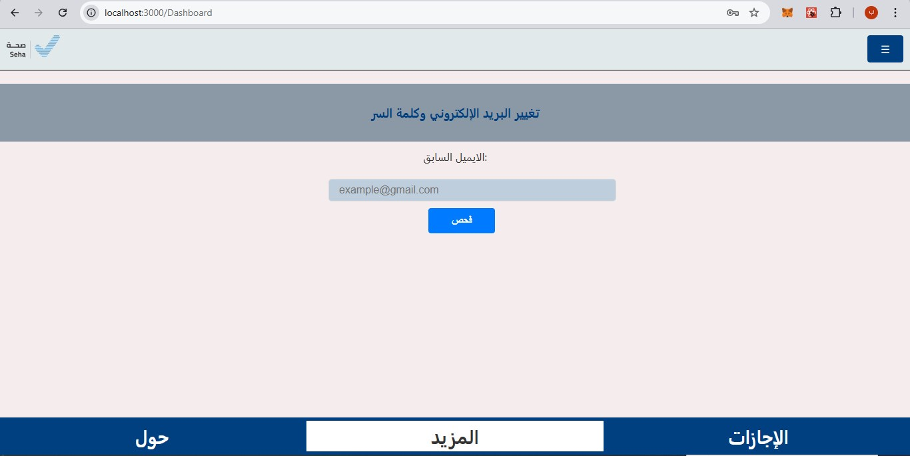

# صحتي - منصة الإلكترونية لقطع الإجازات المرضية

## مقدمة
**صحتي** هو موقع مبتكر يهدف إلى تسهيل عملية تقديم وقطع الإجازات المرضية بشكل إلكتروني، مما يقلل الجهد ويوفر الوقت للموظفين وأصحاب العمل. يعتمد الموقع على واجهة أمامية تفاعلية باستخدام React، وخلفية قوية باستخدام PHP لمعالجة البيانات وربطها بقاعدة بيانات MySQL.

---

## مميزات المشروع
- **واجهة تفاعلية:** واجهة مستخدم مرنة وسهلة الاستخدام مصممة بـ React.
- **نظام إدارة الإجازات:** يسمح للموظفين بتقديم طلبات الإجازات المرضية وتتبع حالتها.
- **تقارير طبية:** إمكانية عرض وتحميل الإجازات الطبية بصيغة PDF.
- **تكامل API:** لربط النظام مع منصات طبية أخرى (اختياري).

---

## المتطلبات الأساسية
لتشغيل المشروع، تحتاج إلى:
- **Node.js** (الإصدار 16 أو أحدث) لتشغيل واجهة React.
- **PHP** (الإصدار 7.4 أو أحدث) لتشغيل الخادم الخلفي.
- **Composer** لإدارة مكتبات PHP.
- **MySQL** كقاعدة بيانات.
- **XAMPP** (اختياري) لتشغيل الخادم محليًا.
- **npm** لتثبيت حزم واجهة React.

---

## إعداد المشروع

### 1. استنساخ المشروع
قم باستنساخ المستودع إلى جهازك:
```bash
git clone https://github.com/BSPSoft/sehaty/
cd sehaty
```

---

### 2. إعداد واجهة المستخدم (React)
1. انتقل إلى مجلد الواجهة الأمامية:
   ```bash
   cd seha
   ```
2. قم بتثبيت الحزم المطلوبة:
   ```bash
   npm install
   ```
3. تشغيل واجهة المستخدم محليًا:
   ```bash
   npm start
   ```

---

### 3. إعداد الخادم الخلفي (PHP)
1. انتقل إلى مجلد الخلفية:
   ```bash
   cd backend
   ```
2. تثبيت الحزم باستخدام Composer:
   ```bash
   composer install
   ```
3. إعداد قاعدة البيانات:
   - أنشئ قاعدة بيانات جديدة باسم `sahti_db`.
   - استورد ملف قاعدة البيانات:
   - `server/db/sehatydb.sql`
    
4. تشغيل الخادم باستخدام XAMPP أو أي خادم محلي آخر.


---

## الاستخدام

1. **الدخول إلى الموقع:**
   - للوصول إلى الواجهة الأمامية، افتح الرابط:  
     `http://localhost:3000`
   -   للوصول إلى الخلفية قواعد بيانات php (API)، افتح الرابط:  
     `http://localhost/phpmyadmin/`

2. **المستخدمون الافتراضيون:**
   - **الإدارة:**
     - البريد الالكتروني : `admin@gmail.com`
     - كلمة المرور: `1qa2ws3d`

---

## هيكل المشروع
- **src/**: يحتوي على واجهة المستخدم المصممة بـ React.
- **server/**: يحتوي على ملفات PHP للتعامل مع الطلبات وقاعدة البيانات.
- **server/db/sehatydb.sql**: ملف  قاعدة البيانات.

---

## التقنيات المستخدمة
- **React**: لإنشاء واجهة المستخدم.
- **PHP**: لمعالجة الطلبات.
- **MySQL**: لتخزين بيانات الإجازات والمستخدمين.

---

## المساهمة
إذا كنت ترغب في تحسين المشروع أو إضافة ميزات جديدة، يمكنك فتح طلب سحب (Pull Request) أو إنشاء مشكلة (Issue) في مستودع المشروع.

---

## حقوق الملكية
تم تطوير هذا المشروع بواسطة [BSpSoft] [basheer-al-shamiry]. جميع الحقوق محفوظة © 2025.


---

## معاينة







---